

<picture>
  <source media="(prefers-color-scheme: dark)" srcset="./assets/hero-dark.svg" />
  <source media="(prefers-color-scheme: light)" srcset="./assets/hero-light.svg" />
  
</picture>

  

<a href="https://ahsan-mahfuz.pages.dev/">
  <picture>
    <source media="(prefers-color-scheme: dark)" srcset="./assets/btn-portfolio-dark.svg" />
    <source media="(prefers-color-scheme: light)" srcset="./assets/btn-portfolio-light.svg" />
    
  </picture>
</a>
<a href="https://www.linkedin.com/in/ahsan-mahfuz-24b30a202/">
  <picture>
    <source media="(prefers-color-scheme: dark)" srcset="./assets/btn-linkedin-dark.svg" />
    <source media="(prefers-color-scheme: light)" srcset="./assets/btn-linkedin-light.svg" />
    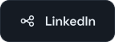
  </picture>
</a>
<a href="https://github.com/Ahsan-Mahfuz?tab=repositories">
  <picture>
    <source media="(prefers-color-scheme: dark)" srcset="./assets/btn-github-dark.svg" />
    <source media="(prefers-color-scheme: light)" srcset="./assets/btn-github-light.svg" />
    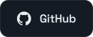
  </picture>
</a>
<a href="https://www.facebook.com/asn.mfuz/">
  <picture>
    <source media="(prefers-color-scheme: dark)" srcset="./assets/btn-facebook-dark.svg" />
    <source media="(prefers-color-scheme: light)" srcset="./assets/btn-facebook-light.svg" />
    
  </picture>
</a>

  

<!-- Numbers come from the GitHub API and are re-rendered twice a day
     by .github/workflows/refresh-assets.yml -->
<picture>
  <source media="(prefers-color-scheme: dark)" srcset="./assets/stats-dark.svg" />
  <source media="(prefers-color-scheme: light)" srcset="./assets/stats-light.svg" />
  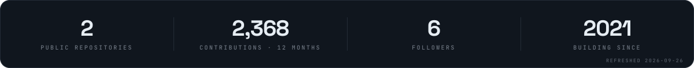
</picture>

 

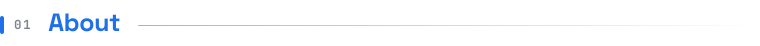

I'm a full-stack developer from Bangladesh who ships **whole products, not just screens**. A typical
delivery from me is four repositories that belong together: a typed REST API, an admin dashboard for
the team running the business, a merchant or staff dashboard for day-to-day operations, and the
customer-facing web or mobile app in front of it all.

Most of that work is **TypeScript on both sides** — Next.js and React on the front, Node.js and
Express with MongoDB behind it — with Redux Toolkit and RTK Query holding the data layer together.
Lately I've been extending the same products onto mobile with **Flutter**.

<picture>
  <source media="(prefers-color-scheme: dark)" srcset="./assets/about-dark.svg" />
  <source media="(prefers-color-scheme: light)" srcset="./assets/about-light.svg" />
  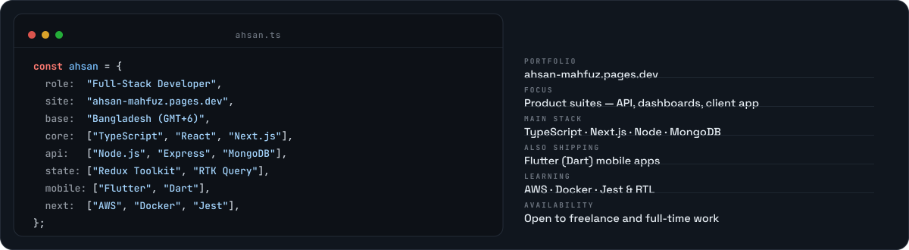
</picture>

Portfolio → **[ahsan-mahfuz.pages.dev](https://ahsan-mahfuz.pages.dev/)** &nbsp;·&nbsp;
Say hello → **[LinkedIn](https://www.linkedin.com/in/ahsan-mahfuz-24b30a202/)**

 

<table>
<tr>
<td width="33%" valign="top">

### Customer-facing apps

Next.js and React front-ends — server rendering, route-level code splitting, responsive layouts and
keyboard-accessible components.

`Next.js` `React` `TypeScript` `Tailwind CSS` `Framer Motion`

</td>
<td width="33%" valign="top">

### APIs and backends

Node.js and Express services — modular routes, Mongoose schemas, JWT auth with roles, file uploads,
validation and pagination, real-time channels where they earn their keep.

`Node.js` `Express` `MongoDB` `Mongoose` `JWT` `Socket.io`

</td>
<td width="33%" valign="top">

### Admin & ops dashboards

The screens the business actually runs on — role-based access, searchable tables, filters, bulk
actions and reporting views, with RTK Query keeping server state honest.

`Redux Toolkit` `RTK Query` `Ant Design` `TypeScript`

</td>
</tr>
</table>

 

<picture>
  <source media="(prefers-color-scheme: dark)" srcset="./assets/stack-dark.svg" />
  <source media="(prefers-color-scheme: light)" srcset="./assets/stack-light.svg" />
  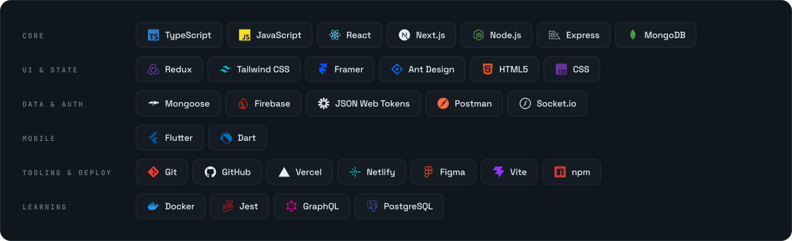
</picture>

<!-- > Also picking up **AWS** for deployment beyond Vercel and Netlify. Logos are official -->
<!-- > [simple-icons](https://simpleicons.org) marks, rendered into the card at build time. -->

 

<!--
  Card blurbs describe how each product is split across repositories — that is what the repo names
  guarantee. Swap in a sharper one-liner (and add a GitHub description to each repo) when you can;
  the language and "updated" chips refresh themselves from the API twice a day.
-->

<table>
<tr>
<td width="50%" valign="top">

<a href="https://github.com/Ahsan-Mahfuz/happyphoto_backend">
  <picture>
    <source media="(prefers-color-scheme: dark)" srcset="./assets/proj-happy-photo-dark.svg" />
    <source media="(prefers-color-scheme: light)" srcset="./assets/proj-happy-photo-light.svg" />
    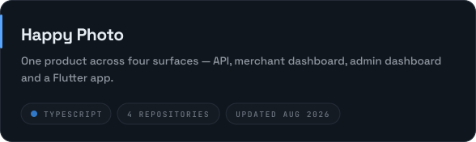
  </picture>
</a>

[API](https://github.com/Ahsan-Mahfuz/happyphoto_backend) · [Merchant dashboard](https://github.com/Ahsan-Mahfuz/happyphoto_merchant_dashboard) · [Admin dashboard](https://github.com/Ahsan-Mahfuz/happyphoto_admin_dashboard) · [Flutter app](https://github.com/Ahsan-Mahfuz/happy_photo_app)

</td>
<td width="50%" valign="top">

<a href="https://github.com/Ahsan-Mahfuz/theo_backend">
  <picture>
    <source media="(prefers-color-scheme: dark)" srcset="./assets/proj-theo-dark.svg" />
    <source media="(prefers-color-scheme: light)" srcset="./assets/proj-theo-light.svg" />
    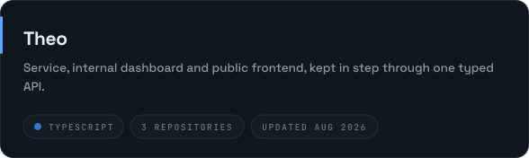
  </picture>
</a>

[API](https://github.com/Ahsan-Mahfuz/theo_backend) · [Dashboard](https://github.com/Ahsan-Mahfuz/theo_dashboard) · [Frontend](https://github.com/Ahsan-Mahfuz/theo_frontend)

</td>
</tr>
<tr>
<td width="50%" valign="top">

<a href="https://github.com/Ahsan-Mahfuz/georgecowin385_net_snap_frontend">
  <picture>
    <source media="(prefers-color-scheme: dark)" srcset="./assets/proj-net-snap-dark.svg" />
    <source media="(prefers-color-scheme: light)" srcset="./assets/proj-net-snap-light.svg" />
    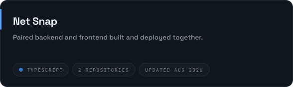
  </picture>
</a>

[Backend](https://github.com/Ahsan-Mahfuz/georgecowin385_net_snap_backend) · [Frontend](https://github.com/Ahsan-Mahfuz/georgecowin385_net_snap_frontend)

</td>
<td width="50%" valign="top">

<a href="https://github.com/Ahsan-Mahfuz/bitechx-product-management-app">
  <picture>
    <source media="(prefers-color-scheme: dark)" srcset="./assets/proj-product-management-dark.svg" />
    <source media="(prefers-color-scheme: light)" srcset="./assets/proj-product-management-light.svg" />
    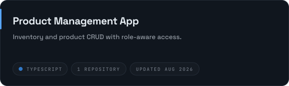
  </picture>
</a>

[Repository](https://github.com/Ahsan-Mahfuz/bitechx-product-management-app)

</td>
</tr>
<tr>
<td width="50%" valign="top">

<a href="https://github.com/Ahsan-Mahfuz/weather-api">
  <picture>
    <source media="(prefers-color-scheme: dark)" srcset="./assets/proj-weather-api-dark.svg" />
    <source media="(prefers-color-scheme: light)" srcset="./assets/proj-weather-api-light.svg" />
    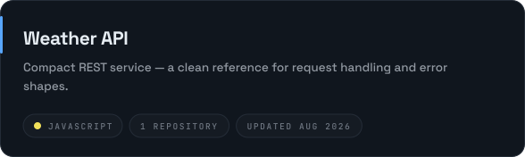
  </picture>
</a>

[Repository](https://github.com/Ahsan-Mahfuz/weather-api)

</td>
<td width="50%" valign="top">

 

Client work, experiments and everything in between —
[browse all public repositories →](https://github.com/Ahsan-Mahfuz?tab=repositories)

</td>
</tr>
</table>

 

- **Types first.** One shared shape for the API response and the component that renders it, so a
  contract change breaks at compile time instead of in production.
- **Server state is not client state.** RTK Query caches and invalidates it; component state stays
  for things the user is actively doing.
- **Boring, readable modules** beat clever abstractions. The next developer — often me, six months
  later — should not need a tour.
- **Ship in vertical slices.** One feature working end to end is worth more than three half-built
  layers.
- **Performance and accessibility are requirements**, not a follow-up ticket: real keyboard focus,
  labelled controls, images sized, bundles watched.
- **Hand over properly** — README, `.env.example`, seed data, and a deploy that someone else can run.

 

<!--
  Everything in this section is pulled live from the GitHub API on page load.

  The two cards below use the free public github-readme-stats instance, which answers 503 once its
  daily Vercel quota runs out. Permanent fix: deploy your own copy —
  https://github.com/anuraghazra/github-readme-stats#deploy-on-your-own-vercel-instance
  — then replace every `github-readme-stats.vercel.app` in this file with `<your-app>.vercel.app`.
-->

<picture>
  <source media="(prefers-color-scheme: dark)" srcset="https://github-readme-stats.vercel.app/api?username=Ahsan-Mahfuz&show_icons=true&include_all_commits=true&count_private=true&hide_border=true&bg_color=00000000&title_color=58A6FF&icon_color=58A6FF&text_color=9198A1&rank_icon=github" />
  <source media="(prefers-color-scheme: light)" srcset="https://github-readme-stats.vercel.app/api?username=Ahsan-Mahfuz&show_icons=true&include_all_commits=true&count_private=true&hide_border=true&bg_color=00000000&title_color=0969DA&icon_color=0969DA&text_color=59636E&rank_icon=github" />
  
</picture>
<picture>
  <source media="(prefers-color-scheme: dark)" srcset="https://github-readme-stats.vercel.app/api/top-langs/?username=Ahsan-Mahfuz&layout=compact&langs_count=8&hide_border=true&bg_color=00000000&title_color=58A6FF&text_color=9198A1" />
  <source media="(prefers-color-scheme: light)" srcset="https://github-readme-stats.vercel.app/api/top-langs/?username=Ahsan-Mahfuz&layout=compact&langs_count=8&hide_border=true&bg_color=00000000&title_color=0969DA&text_color=59636E" />
  
</picture>

  

<picture>
  <source media="(prefers-color-scheme: dark)" srcset="https://streak-stats.demolab.com?user=Ahsan-Mahfuz&hide_border=true&background=00000000&stroke=242C37&ring=58A6FF&fire=58A6FF&currStreakLabel=58A6FF&sideLabels=9198A1&currStreakNum=E6EDF3&sideNums=E6EDF3&dates=6E7681" />
  <source media="(prefers-color-scheme: light)" srcset="https://streak-stats.demolab.com?user=Ahsan-Mahfuz&hide_border=true&background=00000000&stroke=D1D9E0&ring=0969DA&fire=0969DA&currStreakLabel=0969DA&sideLabels=59636E&dates=818B98" />
  
</picture>

 

<picture>
  <source media="(prefers-color-scheme: dark)" srcset="https://github-readme-activity-graph.vercel.app/graph?username=Ahsan-Mahfuz&bg_color=00000000&color=9198A1&line=58A6FF&point=E6EDF3&area=true&area_color=1F6FEB&hide_border=true&custom_title=Commits%20%E2%80%94%20last%2031%20days" />
  <source media="(prefers-color-scheme: light)" srcset="https://github-readme-activity-graph.vercel.app/graph?username=Ahsan-Mahfuz&bg_color=00000000&color=59636E&line=0969DA&point=1F2328&area=true&area_color=58A6FF&hide_border=true&custom_title=Commits%20%E2%80%94%20last%2031%20days" />
  
</picture>

  

<!-- Regenerated every 12 hours by .github/workflows/snake.yml -->
<picture>
  <source media="(prefers-color-scheme: dark)" srcset="https://raw.githubusercontent.com/Ahsan-Mahfuz/Ahsan-Mahfuz/output/github-snake-dark.svg" />
  <source media="(prefers-color-scheme: light)" srcset="https://raw.githubusercontent.com/Ahsan-Mahfuz/Ahsan-Mahfuz/output/github-snake.svg" />
  
</picture>

<!--
  Trophy card is off: the public github-profile-trophy instance currently answers HTTP 402
  (suspended deployment). Uncomment when it is back, or self-host it.

  
-->

 

<picture>
  <source media="(prefers-color-scheme: dark)" srcset="./assets/connect-dark.svg" />
  <source media="(prefers-color-scheme: light)" srcset="./assets/connect-light.svg" />
  
</picture>

 

<a href="https://ahsan-mahfuz.pages.dev/">
  <picture>
    <source media="(prefers-color-scheme: dark)" srcset="./assets/btn-portfolio-dark.svg" />
    <source media="(prefers-color-scheme: light)" srcset="./assets/btn-portfolio-light.svg" />
    
  </picture>
</a>
<a href="https://www.linkedin.com/in/ahsan-mahfuz-24b30a202/">
  <picture>
    <source media="(prefers-color-scheme: dark)" srcset="./assets/btn-linkedin-dark.svg" />
    <source media="(prefers-color-scheme: light)" srcset="./assets/btn-linkedin-light.svg" />
    
  </picture>
</a>
<a href="https://github.com/Ahsan-Mahfuz?tab=repositories">
  <picture>
    <source media="(prefers-color-scheme: dark)" srcset="./assets/btn-github-dark.svg" />
    <source media="(prefers-color-scheme: light)" srcset="./assets/btn-github-light.svg" />
    
  </picture>
</a>

  

